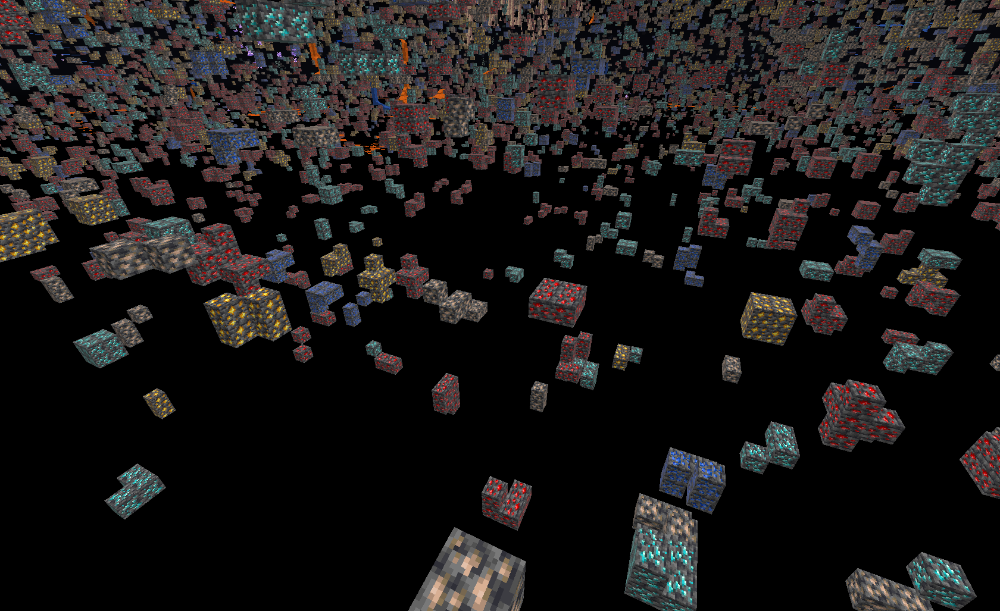
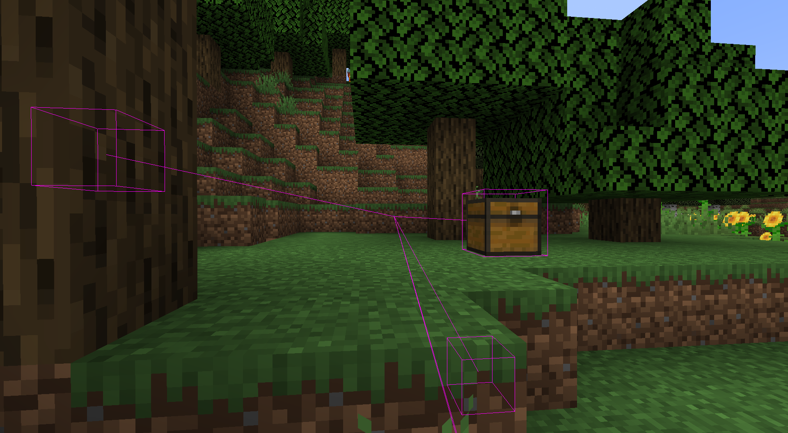
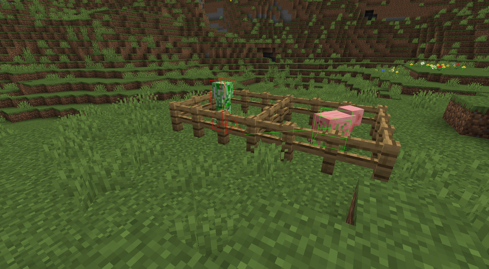
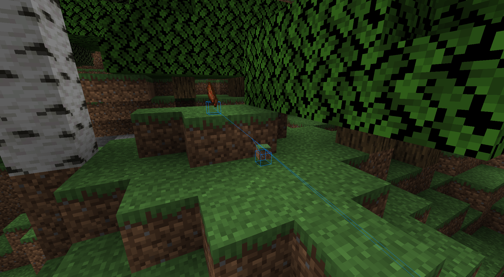
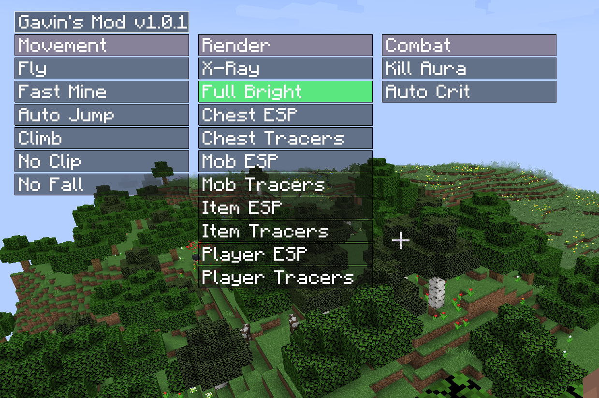

# Gavin's Mod v1.2.0

A "mod" that actually contains hacks/cheats for Minecraft.

## 1.19 Migration TO-DO list

- [ ] Figure out how to make fullbright work again
- [x] Figure out how to draw the squares for the gui
- [x] Fix chat commands

---

## Features

- X-Ray
  
- Full Bright
  
- Chest ESP & Tracers (both configured individually)
  
- Mob ESP & Tracers
  
- Item ESP & Tracers
  
- Fly
- Fast Mine
- Fast Place
- Anti Pumpkin Shadow
- Auto Jump
- Wall Climb
- Kill Aura
- Auto Crit
- No Fall
- No Clip
- In Game GUI (example below - may be outdated)
  
  - Also a text-based HUD
- Anti Camera Bob
---

## Installation

- Please install fabric from [here](https://fabricmc.net/use/installer/).
- Navigate to your Minecraft installation directory (Windows is usually `%appdata%`), and drop in the jar downloaded
  from the [releases page](https://github.com/gt3ch1/minecraft-mod/releases) to the `mods` folder.
- Start Minecraft! The default keybinding for the GUI is `I`. Each mod can have its own separate keybinding, or can be
  indivually toggled through the GUI.

---

## License

This project is licensed under the [MIT license](LICENSE.md).

---

## Contributing

Please see the [Contributing Guide](CONTRIBUTING.md) and the [Code of Conduct](CODE_OF_CONDUCT.md).

---

## Issues and Pull Requests

Please use only the templates provided. Any other templates will be automatically dismissed.

