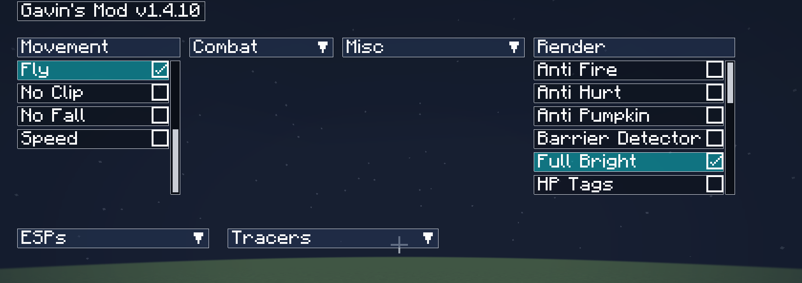

# Gavin's Extensible Mod v1.4.6

---
## Quick Terminology

- **GEM**: A Minecraft mod that is built with the gemclient-core, gavui, or gavinsmod-events libraries.
  These mods are meant to be extensible, and exist without dependencies to other GEMs.
---
## How do I install everything?

1. Download fabric for Minecraft 1.20.1: [https://fabricmc.net/use/installer/](https://fabricmc.net/use/installer/)
2.
Download `fabric-language-kotlin`: [https://www.curseforge.com/minecraft/mc-mods/fabric-language-kotlin/files/4654791](https://www.curseforge.com/minecraft/mc-mods/fabric-language-kotlin/files/4654791)
3. Download `gemclient-core` under the releases tab.
4. Download `gavui` under the releases tab.
5. Download `gavinsmod-events` under the releases tab.
6. Mix and match the GEMs you want to use from the releases tab.

Start Minecraft!

---
## Features

- X-Ray
  
    - With a fully configurable X-Ray filter (inspired by ate47's Xray)
      
- Full Bright
  
- Chest ESP & Tracers (both configured individually)
  
- Dolphin
- Mob ESP & Tracers
  
- Item ESP & Tracers
  
- Radar
    - 
    - Configurable point size, radar size, entities drawn, and colors.
- Fly
- Fast Mine
- Fast Place
- Anti Pumpkin Overlay
- Auto Jump
- Wall Climb
- Kill Aura
- Auto Crit
- No Fall
- No Clip
- In Game GUI, featuring draggable, dropdown, and scrollable elements with clickable elements.
  
    - There is also a text-based overlay that will show you what mods are currently active
- Settings UI, allowing YOU to change certain elements of the mod.
  
    - You can configure what colors are for what part of the mod. Almost every color is configurable.
- Anti Camera Bob
- FPS counter
    - Colors based off of what percentage of your frames you are getting
- HP tags
- NoRain
- Waypoints
    - Fully configurable, including color, location, tracer, and esp.
      
- All the colors seen are fully customizable via the settings screen.

---
## What is this repository?

This repository serves as a conglomerate of the following projects:

- [gavui](https://github.com/GT3CH1/gavui)
- [gavinsmod-events](https://github.com/gavinsmod/gavinsmod-events)
- [gemclient-core](https://github.com/gavinsmod/gemclient-core)
- And all the other `mod-*` repositories seen in the [gavinsmod organization](https://github.com/gavinsmod)
  The sole purpose of repository is to aid in the development of _preexisting_ GEMs and the core
  projects that make up the GEM client. There is a helper script that will allow you to build all the GEMs and the
  core projects into their respective jars, as well as install them into your Minecraft directory if wanted.
- (see the [How do I build this project?](#how-do-i-build-this-project) section)

This repository will also be the repository to get up-to-date releases of the
GEMs contained within this repository (for example: fullbright, xray, tracers),
as well an up-to-date release of the gemclient-core library, which is required
for all GEMs to work.

This repository will also host an up-to-date release of GavUI and gavinsmod-events.
The home location for these projects are at the following locations:
- GavUI: [https://github.com/GT3CH1/gavui](https://github.com/GT3CH1/gavui)
- gavinsmod-events: [https://github.com/gavinsmod/gavinsmod-events](https://github.com/gavinsmod/gavinsmod-events)

---
## How can I help contribute to this project?

If you are interested in contributing to this project, please read the [CONTRIBUTING.md](CONTRIBUTING.md) file.
If you want to request a feature, please open an issue in this repository! If your feature is accepted,
a separate repository for that feature will be created (unless otherwise warranted), and that project will be included
in this repository.

---
## How do I build this project?

Please run the `build.py` python script to build a portion or all of the core
gavinsmod-client project. There are several options in this script that will
help you with building this project.
- `--clean`
    - Whether to clean a given project before building. For example, `./build.py
      --clean`
    - Default: `False`
- `--minecraft-dir` 
    - The path to the directory of your Minecraft install. For example, `./build.py
    --minecraft-dir=%APPDATA%\.minecraft\`
    - Default: `~/.minecraft/`
- `--copy`
    - After a successful build, copy the jar file to your Minecraft directory.
      For example, `./build.py --copy`
    - Default: `False`
- `--all`
    - Builds __all__ projects contained into this repository. For example,
      `./build.py --all`
    - Default: `False`
- `--directory`
    - Builds only one of the projects under the given directory. For example,
      `./build.py --directory mods/xray`
    - Default: `None`
- `--build`
    - Builds the project with the above parameters. Example: `./build.py --all
      --copy --build`
    - Default: `False`

As an example, if you want to build everything from scratch and copy to an alternative
Minecraft installation, you may do so by calling: `./build.py --build --all --copy
--minecraft-dir=/some/other/directory`. If you want to only copy everything
(without building again), you will need to run the previous command, but omit
the `--build` directive.

---
## How can I create my own GEM?

Instructions for creating your own GEM will be found at
the [gemclient-core](https://github.com/gavinsmod/gemclient-core/wiki) wiki.
Alternatively, you can clone the [mod-template](https://github.com/gavinsmod/mod-template) repository to create your own
basic GEM.

---

## License

This project is licensed under the [MIT license](LICENSE).

---

## Contributing

Please see the [Contributing Guide](CONTRIBUTING.md) and the [Code of Conduct](CODE_OF_CONDUCT.md).

---

## Issues and Pull Requests

Please use only the templates provided. Any other templates will be automatically dismissed.
If you have a suggestion for a new template, please open an issue or pull request. This does not
need to follow the templates.

## Credits

- GT3CH1
- Starmism
