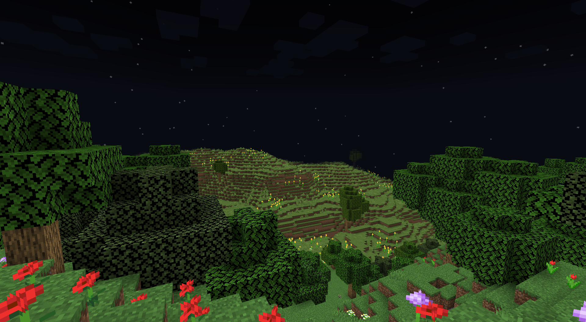
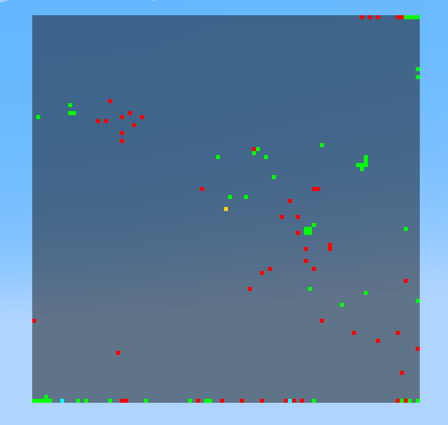

# Gavin's Mod v1.3

## -- NOTE --

If you are upgrading from v1.2 or before, you may need to delete/rename your
settings file located in `.minecraft/mods/gavinsmod/settings.json`. This *should* be done
automatically, but since I cannot guarantee I have tested loading the update with your
config, it may not be.

---

## Features

- X-Ray
  
    - With a fully configurable X-Ray filter (inspired by ate47's Xray)
      
- Full Bright
  
- Chest ESP & Tracers (both configured individually)
  
- Dolphin
- Mob ESP & Tracers
  
- Item ESP & Tracers
  
- Radar
    - 
    - Configurable point size, radar size, entities drawn, and colors.
- Fly
- Fast Mine
- Fast Place
- Anti Pumpkin Overlay
- Auto Jump
- Wall Climb
- Kill Aura
- Auto Crit
- No Fall
- No Clip
- In Game GUI, featuring draggable, dropdown, and scrollable elements with clickable elements.
  
    - There is also a text-based overlay that will show you what mods are currently active
- Settings UI, allowing YOU to change certain elements of the mod.
  
    - You can configure what colors are for what part of the mod. Almost every color is configurable.
- Anti Camera Bob
- FPS counter
    - Colors based off of what percentage of your frames you are getting
- HP tags
- NoRain
- Waypoints
    - Fully configurable, including color, location, tracer, and esp.
      
- All the colors seen are fully customizable via the settings screen.

---

## Installation

- Please install fabric from [here](https://fabricmc.net/use/installer/).
- Navigate to your Minecraft installation directory (Windows is usually `%appdata%`), and drop in the jar downloaded
  from the [releases page](https://github.com/gt3ch1/minecraft-mod/releases) to the `mods` folder.
- Start Minecraft! The default keybinding for the GUI is `I`. Each mod can have its own separate keybinding, or can be
  indivually toggled through the GUI.

---

## License

This project is licensed under the [MIT license](LICENSE).

---

## Contributing

Please see the [Contributing Guide](CONTRIBUTING.md) and the [Code of Conduct](CODE_OF_CONDUCT.md).

---

## Issues and Pull Requests

Please use only the templates provided. Any other templates will be automatically dismissed.
If you have a suggestion for a new template, please open an issue or pull request. This does not
need to follow the templates.

